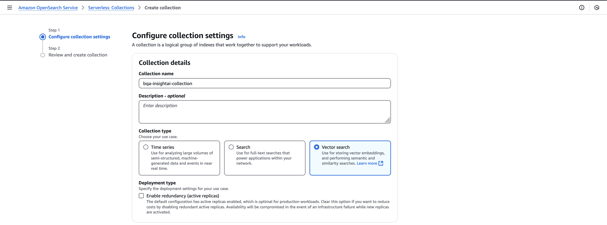

# OpenSearch Serverless Configuration

This README provides step-by-step instructions to configure the vector store for the Knowledge Base, as there is no direct support through the AWS CDK.

## Steps

### 1. Create a Collection
A collection is a group of indexes tailored for a specific use case. For this setup, the collection will analyze reports. Use the **Easy Create** option and choose **Vector Search** as the type.

---

### 2. Create a Vector Index
The vector index stores vector embeddings and associated metadata, adding context to the vectors.

---

### 3. Create a Vector Field
Configure a vector field with the following properties:
- **Name:** `bedrock-knowledge-base-default-vector`
- **Dimension:** `1024` (aligns with the output of Bedrock Embed Titan v2.0).

---

### 4. Configure the Knowledge Base Role
The Knowledge Base requires a predefined role to interface with the vector store. Ensure the following configurations:

#### Trust Permission

#### Required Permissions
1. **Invoke Model** for embedding model:
   
2. **OpenSearch Serverless Full Access**:
   
3. **Amazon OpenSearch Full Access** (AWS Managed Policy).
4. **S3 Full Access** for the specific bucket.

> [!WARNING] Update the collection ARN in the OpenSearch Serverless full access policy with the new ARN during project setup.

---

### 5. Update Data Access Policy
Modify the collection’s data access policy to allow the Knowledge Base role to assume it. Example:

> [!NOTE] When creating the collection through the console, the logged-in user is automatically added to the trust relationship.
