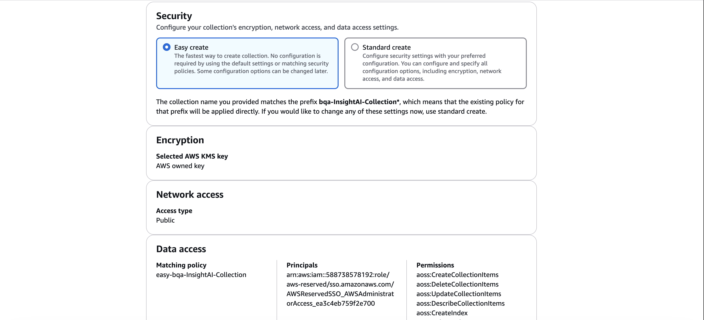
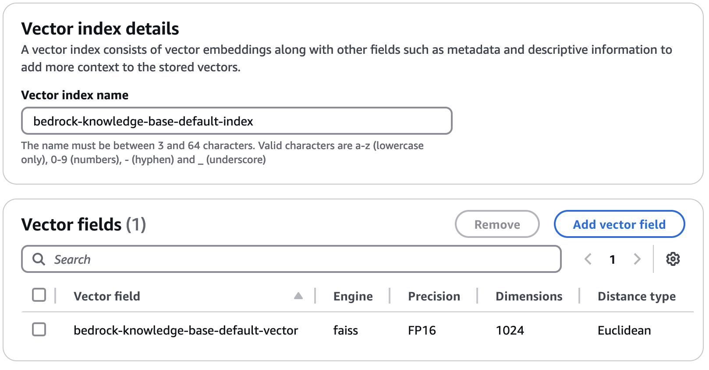
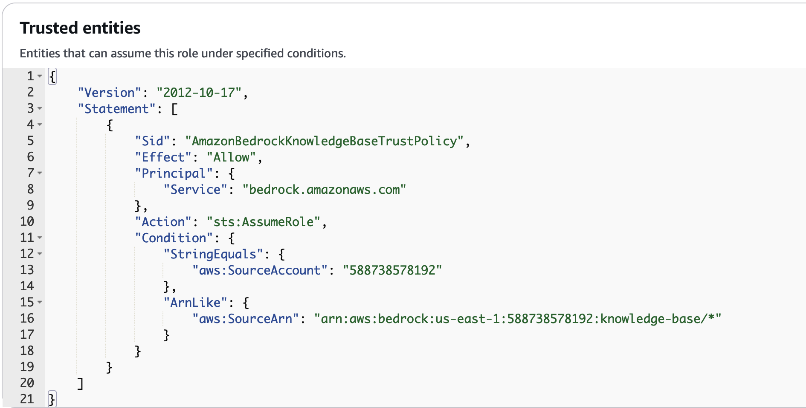
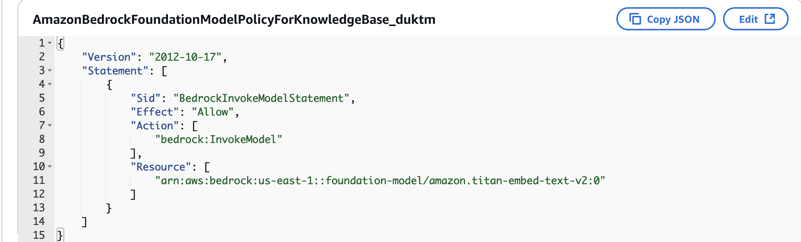
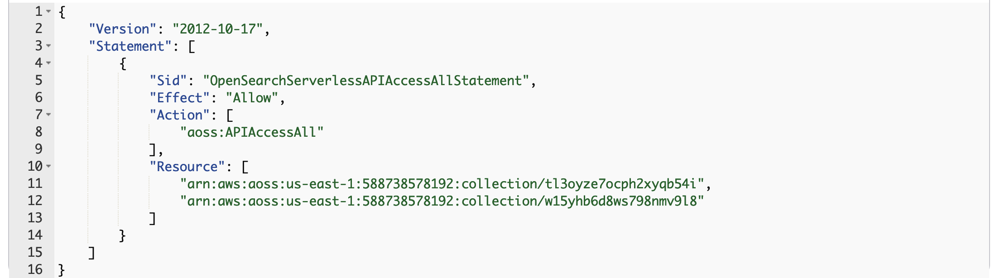
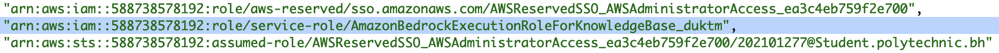

# OpenSearch Serverless Configuration 

 

This document explains how to set up the vector store for the Knowledge Base, since there is no direct way through the AWS CDK. 

 

--- 

 

## Steps: 

1. Create a collection: A collection is a group of indexes that supports a specific use case. In our case, analyzing reports. We can use “Easy Create” to quickly create the collection and use vector search as the type. 

2. Create a vector index: This will contain vector embeddings with metadata if it is available to add more context to stored vectors.

3. Create a vector field: Name it “bedrock-knowledge-base-default-vector" with a dimension of “1024” since this is the output of Bedrock Embed Titan v2.0.

Then the Knowledge Base needs to have a predefined role so that it can communicate with the vector store: 

- Here is the trust permission:
    

- Here is the required permissions:
    - Invoke Model for embeedding model 
    - OpenSearch Serverless full access 
    - Amazon Open Search Full Access (AWS Managed Policy)
    - S3 Full Access for the specific bucket.
  
> [!NOTE]
The collection ARN in OpenSearch Serverless full access policy must be updated with the new ARN of the collection when setting up the project. 

Finally, the data access policy of the collection must be updated so it can be assumed by the knowledgebase role, as follows:

> ![Note] Since the collection is created through the console, the logged in user will be added as trust relationship also.